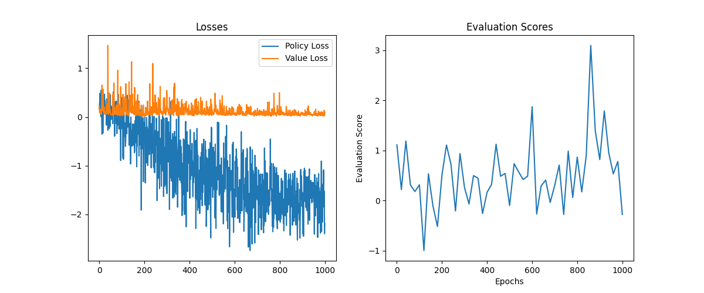
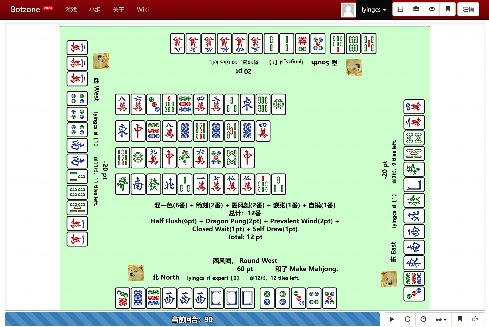

# ruc_gsai_rl_course_project

这是中国人民大学高瓴人工智能学院本科课程《强化学习》的期末项目，项目内容是训练一个适用于国标麻将的强化学习智能体。

> 欢迎大家来到中国人民大学高瓴人工智能学院本科课程《强化学习》的期末项目。在这个项目中，大家将训练一个适用于国标麻将的强化学习智能体。此仓库为同学们提供了一个简易的demo，大家可以在此基础上进行改进和优化。祝大家项目顺利！

## 前置任务

请补全以下文件中的代码：

+ **ppo.py**：补全`policy_loss`与`value_loss`的计算。

## 快速开始

单智能体训练近端策略优化（PPO）算法（对手采用专家策略）

> python train_ppo_expert_opponents.py

使用GUI（图形用户接口）展示策略：

+ [Botzone](https://botzone.org.cn/)网站注册并登录

+ 在“用户存储空间”内上传训练好的模型参数

+ “我的bot”内“创建新bot”
  + 游戏选择“Chinese-Standard-Mahjong”
  +  `__main.py__`内加载模型路径（line 539）换为训练好的模型路径后上传
  + 编译器选择Python 3.6.5
  + 勾选“允许长时运行 /给出输入后不 EOF”与“使用简单交互”
+ 可加入天梯榜，也可在首页创建游戏桌进行手动对局

## 代码结构

+ **agent.py**：自定义`MahjongGBAgent` 基类，按顺序处理玩家在麻将游戏中观察到的事件，并在每个决策点提取状态特征。同时将网络输出的动作转化为游戏事件。

+ **feature.py**：自定义`FeatureAgent` 类，继承自 `MahjongGBAgent`，根据麻将规则处理每个决策点的所有可执行动作，并生成相应的特征表示。
  
+ **model.py**：包含强化学习策略网络、随机策略以及其他可能用于训练和评估的模型。
  
+ **env.py**：自定义环境类`MahjongGBEnv`，继承自 `gym.Env`。该类模拟麻将游戏环境，管理智能体与游戏环境之间的交互，包括状态转换和奖励计算，另外有稠密奖励环境类`MahjongGBEnv_Dense_Reward`与打印对局信息（便于调试）的环境类`MahjongGBEnv_Print`。
  
+ **ppo.py**：近端策略优化（PPO）算法实现。
  
+ **replay_buffer.py**：优先经验回放算法实现。
  
+ **train_ppo_expert_opponents.py**：主要脚本，使用近端策略优化（PPO）算法，通过单一智能体对抗专家策略的方式训练强化学习智能体，对手策略为专家策略。
  
+ **\_\_main\_\_.py**：该脚本用于与 Botzone 平台交互。它处理 Botzone 的输入，通过 `Agent` 类将其转化为状态特征，并将这些特征输入模型以获取动作，再将这些动作格式化为 Botzone 兼容的输出格式。不建议修改此文件；然而，可以通过阅读代码来更好地理解 `Agent` 类的接口以及它与 Botzone 的集成方式。

## 在线对抗平台：[Botzone](https://botzone.org.cn/)

+ [国标麻将交互格式](https://wiki.botzone.org.cn/index.php?title=Chinese-Standard-Mahjong)

+ [算番库的安装和使用](https://github.com/ailab-pku/PyMahjongGB)

+ **上传 Python 多文件 Bot：**

  - 将所有必要的文件打包成一个 zip 文件。运行时，Botzone 将执行 `__main__.py` 脚本。

+ **参数文件：**

  - 管理存储空间，上传所需文件，这些文件在运行时可以从 `data/` 目录中访问。

## 改进空间
  
可进行**新颖的强化学习算法**设计（可参考 [Suphx](https://arxiv.org/abs/2003.13590)、[DouZero](https://arxiv.org/abs/2106.06135)、[MuZero](https://arxiv.org/abs/1911.08265) 等），以解决当前强化学习中的复杂挑战。这些挑战可能包括但不限于：
  
  - **稀疏奖励问题**：在许多现实环境中，奖励信号非常稀疏或延迟，导致传统强化学习算法难以有效学习。通过引入新的奖励机制或基于模型的预估方法，增强算法对稀疏奖励的适应性。

  - **信息不对称与不完全信息**：在许多多智能体系统或策略游戏中，智能体必须在信息不完全的情况下做出决策。通过设计能够处理不完全信息的强化学习算法，提升智能体在此类环境中的表现。

  - **环境动态建模**：在某些情况下，环境规则可能是未知的或高度复杂的。通过开发能够在线学习和适应环境动态的算法，使得智能体能够在更广泛的未知或复杂环境中表现出色。

  - **多智能体交互**：传统的强化学习通常专注于单智能体环境。在复杂多智能体环境中，通过设计新的算法，使得多个智能体能够有效协作或竞争，优化整体系统性能。

  - **高效的策略优化与对抗学习**：在游戏AI或对抗性任务中，快速迭代和优化策略是成功的关键。通过借鉴自我博弈和对抗学习的思想，设计出能够更快适应对手策略变化的算法。
